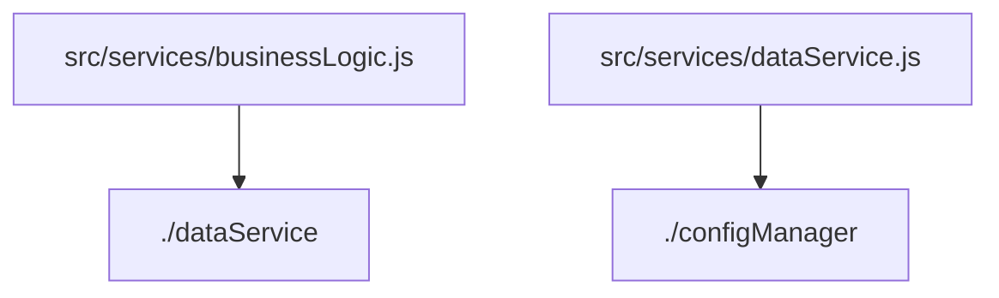

# sourceFrom 字段依赖分析报告

## 字段相关依赖关系图

## 详细依赖列表

### src/services/businessLogic.js
- const dataService = require('./dataService');

### src/services/dataService.js
- const configManager = require('./configManager');

